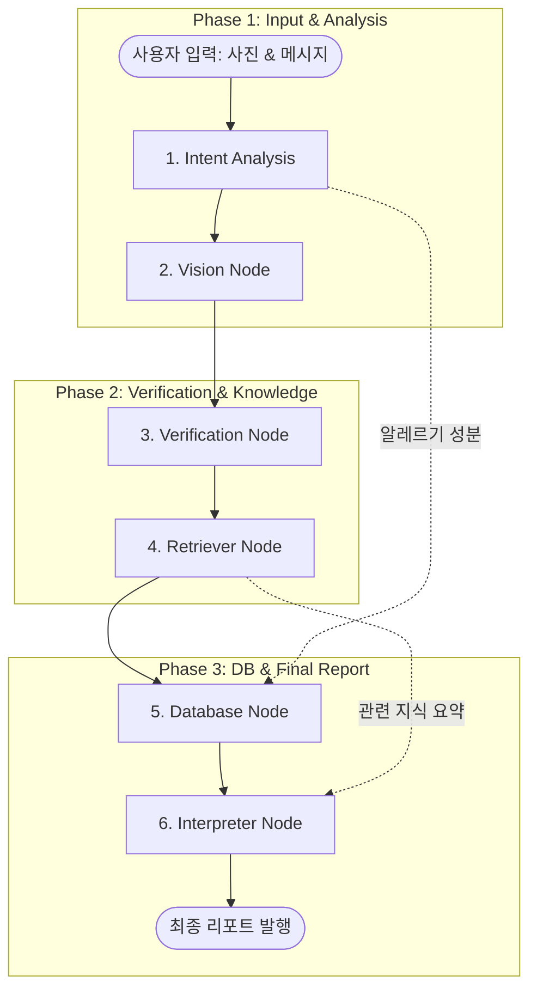

# 🩺 SkinCare-Agent: AI 개인맞춤형 피부 진단 및 성분 분석 시스템

본 문서는 **SkinCare-Agent** 프로젝트의 아키텍처와 작동 원리를 설명하기 위해 작성되었습니다. 발표 시 시각 자료 및 구조 설명으로 활용하시기 바랍니다.

---

## 1. 프로젝트 개요
SkinCare-Agent는 사용자의 **셀카 이미지**와 **채팅 메시지(고민 사항)**를 결합하여 전문적인 피부 분석 리포트와 맞춤형 화장품 추천을 제공하는 멀티모달 AI 솔루션입니다.

---

## 2. 시스템 워크플로우 (LangGraph)

전체 시스템은 **LangGraph**를 통해 순차적이고 논리적인 흐름으로 제어됩니다. 사용자가 사진과 메시지를 입력하면 다음과 같은 과정을 거칩니다.

---

## 3. 상세 노드 설명 (LangGraph Nodes)

### 🟢 1. Intent Analysis Node (의도 분석)
*   **역할**: 유저가 보낸 채팅 메시지에서 핵심 키워드를 추출합니다.
*   **기능**: 사용자가 언급한 **제외 요청 성분(알레르기)**과 현재의 **피부 고민(관련 키워드)**을 GPT-4o가 정밀하게 파악하여 그래프의 상태(State)에 저장합니다.

### 🔵 2. Vision Node (시각 분석)
*   **역할**: 업로드된 사진을 통해 피부 상태를 수치화합니다.
*   **기능**: **MediaPipe**와 **OpenCV**를 결합하여 얼굴 영역에서 **홍조(Redness)**와 **유분(Oiliness)** 점수를 0~100점 사이로 측정합니다.

### 🟡 3. Verification Node (데이터 보정)
*   **역할**: 시공간적 맥락과 조명 조건을 고려하여 분석 결과를 재검증합니다.
*   **기능**: 시각 분석 수치와 유저의 고민 사항을 대조하여, 사진 촬영 환경에 따른 오차를 GPT-4o가 논리적으로 보정합니다.

### 🟣 4. Retriever Node (지식 검색 - RAG)
*   **역할**: 최신 뷰티 블로그 및 전문 지식 베이스에서 정보를 가져옵니다.
*   **기능**: **ChromaDB** 벡터 스토어를 사용하여 사용자의 피부 상태에 맞는 관리법, 유의사항 등의 전문 지식을 검색합니다.

### 🟠 5. Database Node (제품 매칭 & 필터링)
*   **역할**: SQLite DB에서 최적의 화장품을 선별합니다.
*   **기능**: 보정된 피부 수치에 맞는 제품을 선별하며, 특히 **Intent Node에서 추출된 알레르기 성분이 포함된 제품은 SQL 쿼리 레벨에서 원천 차단**합니다.

### 🔴 6. Interpreter Node (최종 해석 및 리포트)
*   **역할**: 모든 데이터를 종합하여 사용자에게 최종 메시지를 구성합니다.
*   **기능**: 
    - 추천 제품들에 대해 **식약처 25종 알레르기 유발 성분** 함유 여부를 이중 체크합니다.
    - 검색된 지식(RAG)을 요약하여 가이드를 제공합니다.
    - 사용자 친화적인 HTML 카드 UI 형태로 리포트를 생성합니다.

---

## 4. 특장점: 2중 알레르기 방어 체계

우리 프로젝트는 사용자의 안전을 위해 **이중 검증 로직**을 가동합니다.

1.  **SQL 필터링 (Prevention)**: 데이터베이스 검색 단계에서 유저가 기피하는 성분이 들어간 제품은 아예 후보군에서 배제합니다.
2.  **Safety Checker (Verification)**: 리포트 생성 직전, 추천된 제품의 전성분을 다시 한번 전수 조사하여 식약처 공식 알러지 유발 성분과 유저 요청 성분을 확인하고 "✅ 안전" 혹은 "⚠️ 경고" 메시지를 표시합니다.

---

## 5. 기술 스택
- **Orchestration**: LangGraph, LangChain
- **LLM**: OpenAI GPT-4o
- **Computer Vision**: OpenCV, MediaPipe
- **Database**: SQLite (Product Info), ChromaDB (Vector Knowledge)
- **Framework**: Streamlit
